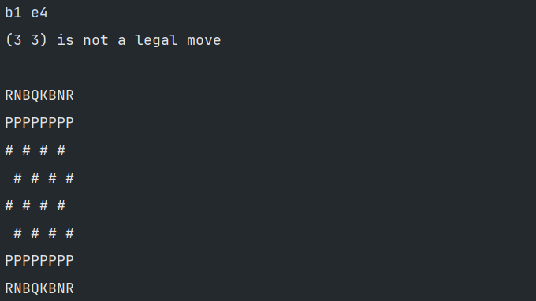

# Chess
a chess game using c 

## Features
- initialize a checkboard and the pieces
- display a checkboard on the console
- determine whether a move is legal or not
- move a piece from string instruction

## Todo
- move a piece, capture etc.
  - Manage pawn rules : direction, capturing, first move, promoting, en passant (see [Wikipedia](https://en.wikipedia.org/wiki/Pawn_(chess)#Placement_and_movement))
- add a move history
- manage the conversion between coordinate and chess notations (ex: Be5) (see [Wikipedia page](https://en.wikipedia.org/wiki/Algebraic_notation_(chess)))
- test check / checkmate
- run a game
  
For later :
- evaluate position (???)
- creating bots
- add elo
  
---


Compiled with :
```
gcc -Wall -Werror -Wextra main.c -o chess ./echiquier.c
```
### Current examples :

Example 1 (illegal knight move)            | Example 2 (correct knight move)
-------------------------------------------|--------------------------------------------
 | 
